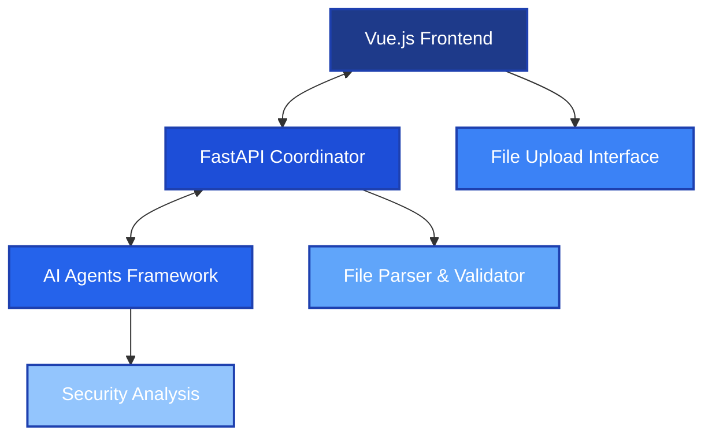

# Strands Security Analysis Platform

A distributed web application that leverages multiple AI agents to analyze software architectures and identify security vulnerabilities using the Strands framework.

## Quick Start

### Development Mode
```bash
# Backend (Terminal 1)
cd /path/to/strands
python -m src.coordinator.main

# Frontend (Terminal 2)
cd frontend
npm install
npm run dev
```

**Access URLs:**
- Frontend: http://localhost:3000
- Backend API: http://localhost:8000
- API Documentation: http://localhost:8000/docs

### Production Mode
```bash
# Using Docker Compose
docker-compose -f docker-compose.prod.yml up --build

# Or using start script
./scripts/prod-start.sh
```

## Prerequisites

**Backend:**
- Python 3.8+
- FastAPI
- Required packages: `pip install -r requirements.txt`

**Frontend:**
- Node.js 16+
- Vue.js 3
- Required packages: `npm install`

## Architecture Overview

### High-Level Architecture


### Solution Overview

**Multi-Agent Security Analysis System:**

1. **File Processing Pipeline**
   - Users upload architecture files (JSON, YAML, Markdown)
   - Coordinator parses and validates file structure
   - Extracted data distributed to specialized agents

2. **AI Agent Ecosystem**
   ```mermaid
   graph TD
       AC[Agent Coordinator] --> NA[Network Security Agent]
       AC --> DA[Data Flow Agent]
       AC --> IA[Infrastructure Agent]
       AC --> CA[Code Security Agent]
       
       NA --> R[Results]
       DA --> R
       IA --> R
       CA --> R
       
       style AC fill:#1e3a8a,stroke:#1e40af,stroke-width:3px,color:#ffffff
       style NA fill:#1d4ed8,stroke:#1e40af,stroke-width:2px,color:#ffffff
       style DA fill:#2563eb,stroke:#1e40af,stroke-width:2px,color:#ffffff
       style IA fill:#3b82f6,stroke:#1e40af,stroke-width:2px,color:#ffffff
       style CA fill:#60a5fa,stroke:#1e40af,stroke-width:2px,color:#ffffff
       style R fill:#1e40af,stroke:#1e40af,stroke-width:2px,color:#ffffff
   ```

3. **Agent Interactions**
   - **NetworkSecurityAgent**: Analyzes firewall rules, service exposure, authentication
   - **DataFlowAgent**: Examines data encryption, PII handling, data flows
   - **InfrastructureAgent**: Reviews IAM policies, storage configurations, access controls
   - **CodeSecurityAgent**: Scans for hardcoded secrets, authentication mechanisms

4. **Analysis Workflow**
   ```mermaid
   flowchart LR
       A[Upload] --> B[Parse]
       B --> C[Distribute]
       C --> D[Analyze]
       D --> E[Correlate]
       E --> F[Report]
       
       F --> G[Risk Score]
       F --> H[Recommendations]
       F --> I[Security Findings]
       
       B --> J[Data Validation]
       C --> K[Agent Coordination]
       D --> L[Security Analysis]
       
       style A fill:#1e3a8a,stroke:#1e40af,stroke-width:2px,color:#ffffff
       style B fill:#1d4ed8,stroke:#1e40af,stroke-width:2px,color:#ffffff
       style C fill:#2563eb,stroke:#1e40af,stroke-width:2px,color:#ffffff
       style D fill:#3b82f6,stroke:#1e40af,stroke-width:2px,color:#ffffff
       style E fill:#60a5fa,stroke:#1e40af,stroke-width:2px,color:#ffffff
       style F fill:#1e40af,stroke:#1e40af,stroke-width:3px,color:#ffffff
       style G fill:#1c2951,stroke:#1e40af,stroke-width:2px,color:#ffffff
       style H fill:#2d3748,stroke:#1e40af,stroke-width:2px,color:#ffffff
       style I fill:#2b6cb0,stroke:#1e40af,stroke-width:2px,color:#ffffff
       style J fill:#3182ce,stroke:#1e40af,stroke-width:2px,color:#ffffff
       style K fill:#4299e1,stroke:#1e40af,stroke-width:2px,color:#ffffff
       style L fill:#63b3ed,stroke:#1e40af,stroke-width:2px,color:#ffffff
   ```

## Key Features

- **Multi-Agent Analysis**: Specialized AI agents for different security domains
- **Real-time Processing**: Asynchronous analysis with live progress tracking
- **Comprehensive Reporting**: Detailed findings with risk scores and recommendations
- **Multiple File Formats**: Support for JSON, YAML, and Markdown architecture files
- **Modern UI**: Responsive Vue.js interface with dark mode support
- **Production Ready**: Docker containerization and CI/CD pipeline

## Agent Capabilities

| Agent | Focus Area | Key Checks |
|-------|------------|------------|
| **Network** | Network Security | Firewall rules, service exposure, authentication |
| **Data Flow** | Data Protection | Encryption, PII handling, data flows |
| **Infrastructure** | Cloud Security | IAM policies, storage access, permissions |
| **Code** | Application Security | Hardcoded secrets, authentication, MFA |

## Testing

```bash
# Backend Tests
pytest tests/ --junitxml=test-results/test-results.xml --cov=src --cov-report=xml:test-results/coverage.xml

# Frontend Tests  
cd frontend
npm run test:coverage
npm run lint
npm run e2e
```

**Test Coverage:**
- Backend: 16 tests covering API endpoints, parsers, and agents
- Frontend: 20 tests covering components, services, and composables
- Total: 36 tests with comprehensive coverage

**Test Results Location:**
- Backend: `test-results/` directory
- Frontend: `frontend/test-results/` directory

## Deployment

### Docker Deployment
```bash
# Production Environment
docker-compose -f docker-compose.prod.yml up --build

# Development Environment  
docker-compose -f docker-compose.dev.yml up --build

# Test Environment
docker-compose -f docker-compose.test.yml run --rm test-coordinator

# Or use convenience scripts
./scripts/prod-start.sh      # Start production
./scripts/prod-stop.sh       # Stop production
./scripts/prod-uninstall.sh  # Completely remove production
./scripts/dev-start.sh       # Start development
./scripts/dev-stop.sh        # Stop development
./scripts/dev-uninstall.sh   # Completely remove development
./scripts/test-start.sh      # Run containerized tests
./scripts/test-uninstall.sh  # Clean test environment
```

### CI/CD Pipeline
- **Jenkins Pipeline**: Automated build, test, security scan, and deployment
- **Quality Gates**: SonarQube integration with coverage requirements
- **Security Scanning**: SAST, container scanning, dependency checks
- **Monitoring**: Datadog integration for metrics and alerting

## Project Structure

```
strands/
├── src/
│   ├── agents/           # AI security analysis agents
│   ├── coordinator/      # FastAPI backend application
│   ├── models/          # Data models and schemas
│   └── middleware/      # Request/response middleware
├── frontend/
│   ├── src/
│   │   ├── components/  # Vue.js components
│   │   ├── composables/ # Reusable composition functions
│   │   └── services/    # API service layer
│   ├── tests/          # Frontend tests
│   └── test-results/   # Frontend test results
├── tests/              # Backend tests
├── test-results/       # Backend test results
├── scripts/            # Deployment and utility scripts
├── documentation/      # Project documentation
├── docker-compose.dev.yml   # Development environment
├── docker-compose.prod.yml  # Production environment
├── docker-compose.test.yml  # Test environment
└── Jenkinsfile        # CI/CD pipeline configuration
```

## Future Enhancements

- **StrandsAgents Migration**: Transition to advanced AI agent framework
- **Machine Learning**: Threat prediction and continuous learning
- **Threat Intelligence**: Real-time security updates integration
- **Enterprise Features**: SSO, RBAC, audit logging, compliance reporting

## License

This project is licensed under the MIT License - see the LICENSE file for details.

## Contributing

1. Fork the repository
2. Create a feature branch (`git checkout -b feature/amazing-feature`)
3. Commit your changes (`git commit -m 'Add amazing feature'`)
4. Push to the branch (`git push origin feature/amazing-feature`)
5. Open a Pull Request

## Support

For support and questions, please refer to the documentation in the `/documentation` folder or open an issue in the repository.