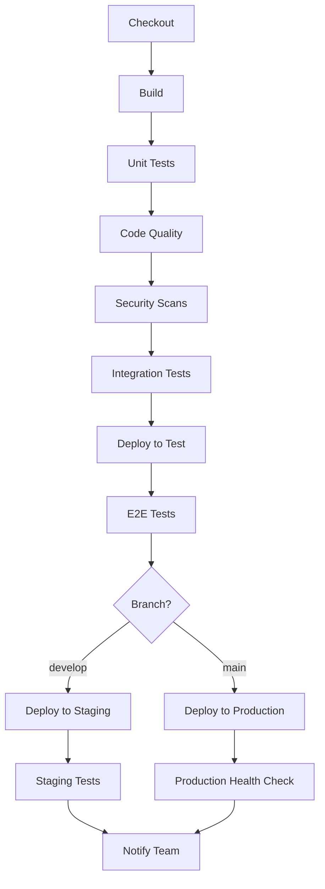

# Jenkins CI/CD Pipeline Structure for Strands Security Analysis Platform

## Overview

This document outlines the recommended Jenkins CI/CD pipeline structure for the Strands Security Analysis Platform, designed for a two-container deployment architecture with separate backend and frontend containers. The pipeline provides a comprehensive approach to automated testing, quality assurance, and coordinated deployment of both services.

## Pipeline Structure



## Stage Breakdown

### 1. Checkout & Setup

**Purpose**: Retrieve source code and verify build environment

```groovy
stage('Checkout') {
    steps {
        // Checkout code from GitHub repository
        git branch: '${BRANCH_NAME}',
            url: 'https://github.com/paulJRCurtis/strands.git',
            credentialsId: 'github-credentials'
        
        // Verify build environment
        sh 'docker --version'
        sh 'docker-compose --version'
        
        // Display repository information
        sh 'git log --oneline -5'
        sh 'ls -la'
    }
}
```

### 2. Build

**Purpose**: Build and tag Docker images for both backend and frontend containers

```groovy
stage('Build') {
    parallel {
        stage('Backend Build') {
            steps {
                sh 'docker build -f backend/Dockerfile -t strands-backend:${BUILD_NUMBER} -t strands-backend:latest .'
            }
        }
        stage('Frontend Build') {
            steps {
                sh 'docker build -f frontend/Dockerfile -t strands-frontend:${BUILD_NUMBER} -t strands-frontend:latest ./frontend'
            }
        }
    }
    post {
        success {
            // Push images to registry
            withCredentials([usernamePassword(credentialsId: 'docker-registry', usernameVariable: 'DOCKER_USER', passwordVariable: 'DOCKER_PASS')]) {
                sh 'echo $DOCKER_PASS | docker login -u $DOCKER_USER --password-stdin'
                sh 'docker push strands-backend:${BUILD_NUMBER}'
                sh 'docker push strands-frontend:${BUILD_NUMBER}'
                sh 'docker push strands-backend:latest'
                sh 'docker push strands-frontend:latest'
            }
        }
    }
}
```

### 3. Testing Stages

#### Unit Tests

```groovy
stage('Unit Tests') {
    parallel {
        stage('Backend Tests') {
            steps {
                sh 'pytest tests/ --junitxml=test-results/junit.xml --cov=src'
            }
        }
        stage('Frontend Tests') {
            steps {
                dir('frontend') {
                    sh 'npm run test:coverage'
                    sh 'npm run lint'
                }
            }
        }
    }
}
```

#### Integration Tests

**Purpose**: Execute comprehensive testing in isolated containerized environments

```groovy
stage('Integration Tests') {
    steps {
        sh 'docker-compose -f docker-compose.test.yml run --rm test-coordinator'
        sh 'docker-compose -f docker-compose.test.yml run --rm test-frontend'
    }
}
```

### 4. Quality & Security

#### Code Quality

```groovy
stage('Code Quality') {
    steps {
        withSonarQubeEnv('SonarQube') {
            sh 'sonar-scanner'
        }
        waitForQualityGate abortPipeline: true
    }
}
```

#### Security Scans

**Purpose**: Enforce code quality standards and identify security vulnerabilities

```groovy
stage('Security Scans') {
    parallel {
        stage('SAST') {
            steps {
                sh 'bandit -r src/ -f json -o bandit-report.json'
            }
        }
        stage('Container Security') {
            steps {
                sh 'trivy image strands-backend:${BUILD_NUMBER}'
                sh 'trivy image strands-frontend:${BUILD_NUMBER}'
            }
        }
    }
}
```

### 5. Deployment Strategy

#### Branch-based Deployment

**Purpose**: Automated deployment based on Git branch strategy

```groovy
stage('Deploy') {
    when {
        anyOf {
            branch 'main'
            branch 'develop'
        }
    }
    steps {
        script {
            def environment = env.BRANCH_NAME == 'main' ? 'production' : 'staging'
            def composeFile = env.BRANCH_NAME == 'main' ? 'docker-compose.prod.yml' : 'docker-compose.dev.yml'
            
            // Deploy using compose file with environment variables from pipeline
            sh "docker-compose -f ${composeFile} down || true"
            sh "docker-compose -f ${composeFile} up -d"
            
            // Wait for containers to be healthy
            sh "docker-compose -f ${composeFile} ps"
            
            // Verify environment configuration loaded
            sh "echo 'Deployed to ${environment} environment'"
        }
    }
}
```

## Pipeline Optimizations

### 1. Parallel Execution
- Build backend and frontend containers simultaneously
- Run unit tests for both services in parallel
- Execute security scans on both container images concurrently
- Deploy both containers with coordinated rollout

### 2. Caching Strategy
- Docker layer caching for faster builds
- npm cache for frontend dependencies
- pip cache for Python packages

### 3. Fail-Fast Approach
- Stop pipeline on first test failure
- Quality gate enforcement
- Security vulnerability blocking

### 4. Artifact Management

```groovy
post {
    always {
        publishTestResults testResultsPattern: '**/test-results/*.xml'
        publishCoverage adapters: [coberturaAdapter('**/coverage.xml')]
        archiveArtifacts artifacts: '**/*-report.json', allowEmptyArchive: true
    }
}
```

## Environment Strategy

| Environment | Branch | Purpose | Deployment |
|-------------|--------|---------|------------|
| **Development** | feature/* | Local development | Manual |
| **Test** | All branches | Automated testing | Containerized |
| **Staging** | develop | Integration testing | Automatic |
| **Production** | main | Live system | Automatic with approval |

## Monitoring & Health Checks

```groovy
stage('Health Check') {
    steps {
        script {
            // Health check for backend container
            for (int i = 0; i < 5; i++) {
                def backendResponse = sh(script: 'curl -f http://localhost:8000/health', returnStatus: true)
                if (backendResponse == 0) {
                    echo "Backend health check passed"
                    break
                } else if (i == 4) {
                    error "Backend health check failed after 5 attempts"
                }
                sleep 30
            }
            
            // Health check for frontend container
            for (int i = 0; i < 5; i++) {
                def frontendResponse = sh(script: 'curl -f http://localhost:3000', returnStatus: true)
                if (frontendResponse == 0) {
                    echo "Frontend health check passed"
                    break
                } else if (i == 4) {
                    error "Frontend health check failed after 5 attempts"
                }
                sleep 30
            }
        }
    }
}
```

## Pipeline Benefits

### Quality Assurance
- **Automated Testing**: Comprehensive test coverage across both frontend and backend services
- **Code Quality Gates**: SonarQube integration with quality enforcement for both codebases
- **Security Scanning**: SAST, container image scanning, and dependency vulnerability detection for both containers

### Deployment Safety
- **Branch-based Strategy**: Coordinated deployment of both containers to appropriate environments
- **Health Monitoring**: Independent health checks for both frontend and backend containers
- **Rollback Capability**: Quick recovery with coordinated rollback of both services
- **Deployment Verification**: Rollout status monitoring for both container deployments

### Development Efficiency
- **Parallel Processing**: Simultaneous build and test execution for both containers
- **Fast Feedback**: Early failure detection across both services with immediate notification
- **Artifact Management**: Comprehensive test result and coverage reporting for both codebases
- **Container Registry**: Automated image tagging and registry management for both services

## Implementation Considerations

### Prerequisites
- Jenkins server with Docker and Docker Compose support
- GitHub repository access with credentials configured in Jenkins
- SonarQube server for code quality analysis of both services
- Docker host for container deployment (no Kubernetes required)
- Container registry for storing both frontend and backend images (optional)
- Docker network for inter-container communication

### GitHub Integration
- **Repository**: https://github.com/paulJRCurtis/strands.git
- **Credentials**: Configure 'github-credentials' in Jenkins
- **Webhook**: Set up GitHub webhook for automatic pipeline triggers
- **Branch Strategy**: main (production), develop (staging), feature/* (testing only)

### Environment Configuration
- **Direct Variables**: Environment variables set directly in Jenkins pipeline based on branch
- **Configuration Management**: Branch-based configuration (main=production, develop=staging)
- **Security**: Sensitive values stored in Jenkins credentials and injected at runtime
- **Validation**: Environment configuration validated during deployment

### Dockerized Agent Considerations

**For Kubernetes Deployment on Dockerized Agents:**

```groovy
// Option 1: Docker Compose deployment (Recommended)
stage('Deploy') {
    steps {
        script {
            // Deploy with environment variables from pipeline
            sh 'docker-compose -f docker-compose.prod.yml up -d'
        }
    }
}

// Option 2: Direct Docker deployment
stage('Deploy') {
    steps {
        script {
            // Stop existing containers
            sh 'docker stop strands-backend strands-frontend || true'
            sh 'docker rm strands-backend strands-frontend || true'
            
            // Start new containers with network
            sh 'docker network create strands-network || true'
            sh "docker run -d --name strands-backend --network strands-network -p 8000:8000 strands-backend:${BUILD_NUMBER}"
            sh "docker run -d --name strands-frontend --network strands-network -p 3000:3000 strands-frontend:${BUILD_NUMBER}"
        }
    }
}

// Option 3: Docker Swarm (for multi-host)
stage('Deploy') {
    steps {
        script {
            sh "docker stack deploy -c docker-compose.prod.yml strands-stack"
        }
    }
}
```

**Agent Configuration Requirements:**
- Mount Docker socket: `-v /var/run/docker.sock:/var/run/docker.sock`
- Docker Compose installed on Jenkins agent
- Network access to target deployment hosts
- Container registry access credentials (if using external registry)
- Docker network configuration for inter-container communication

### Security
- Secure credential management for deployment keys
- Network isolation for test environments
- Container image scanning and vulnerability management

### Monitoring
- Pipeline execution metrics and alerting
- Deployment success/failure notifications
- Performance monitoring and trending

This pipeline structure ensures reliable, secure, and efficient delivery of the Strands Security Analysis Platform's two-container architecture while maintaining high code quality, comprehensive testing coverage, and coordinated deployment of both frontend and backend services.