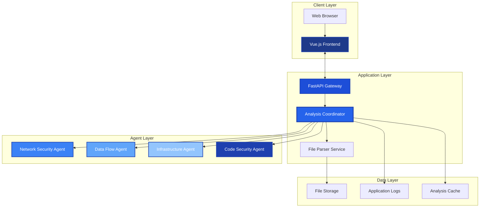
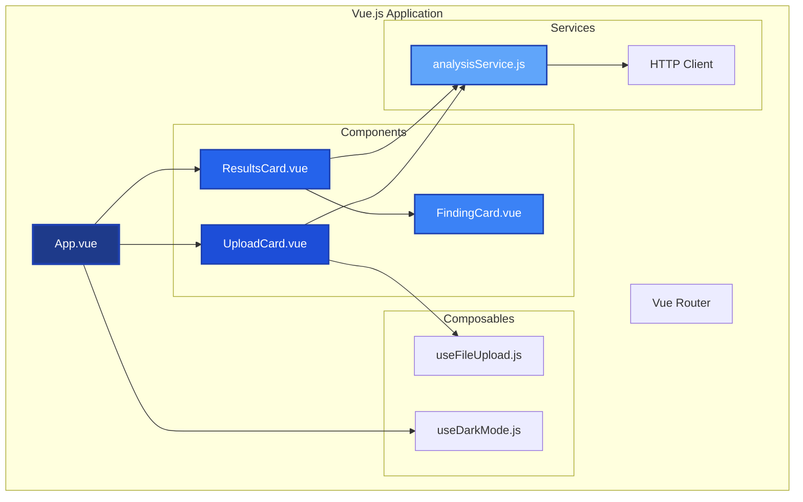
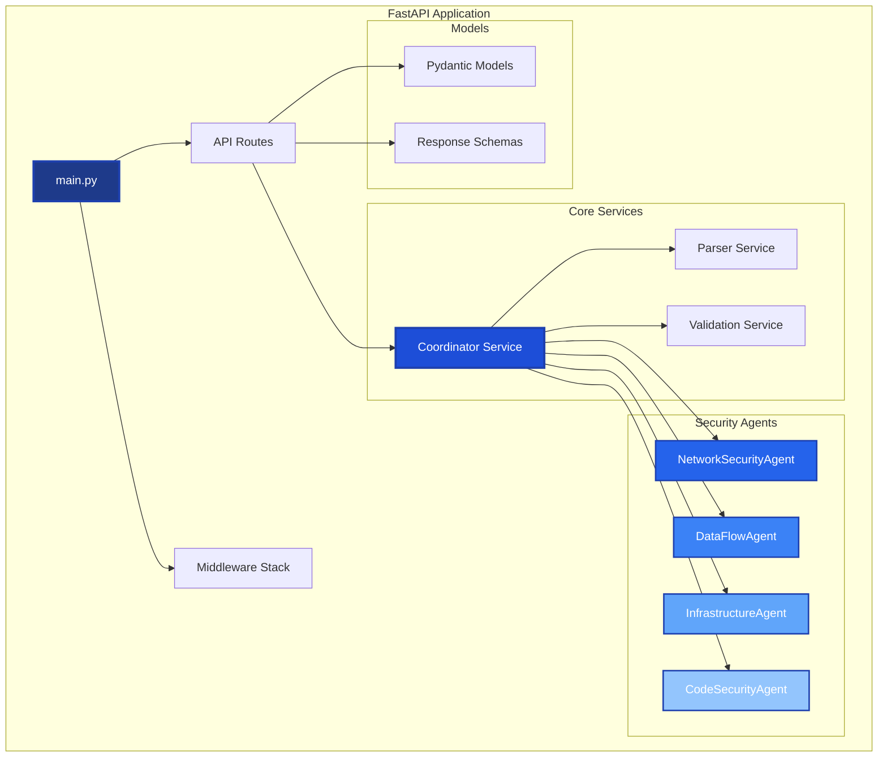
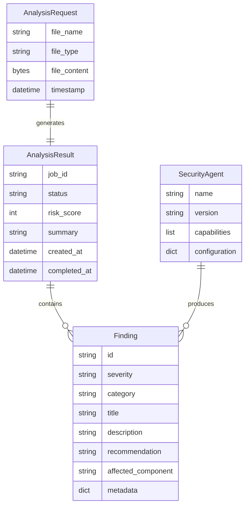
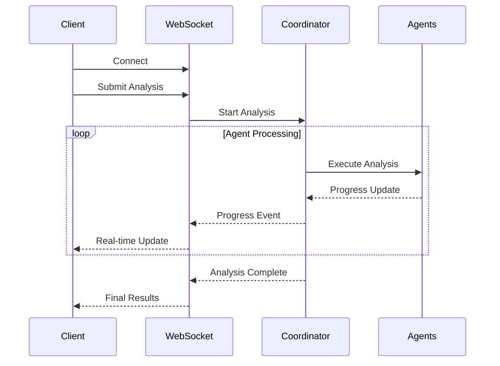
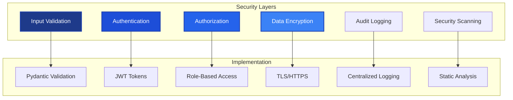
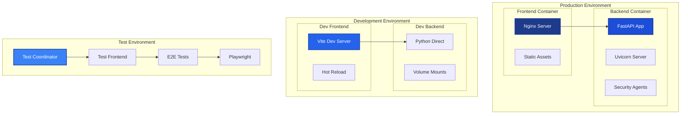
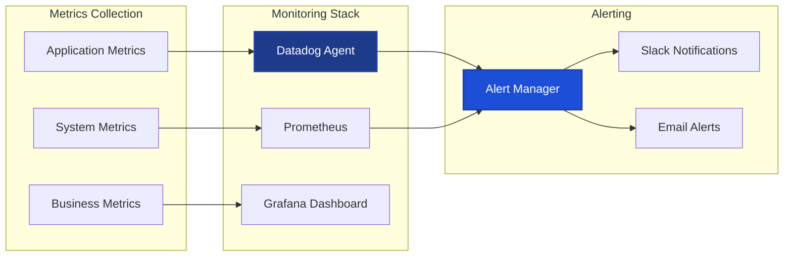
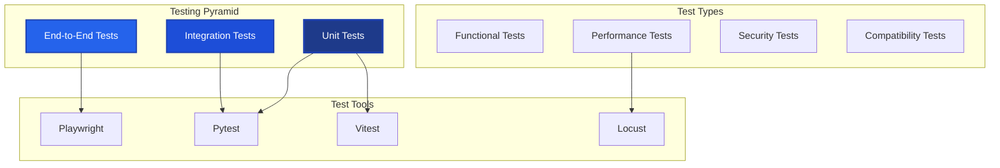
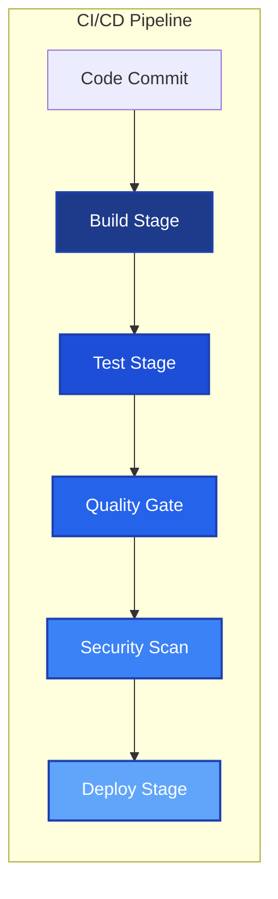

# Strands Security Analysis Platform - Technical Design Document

**Document Version:** 1.0  
**Date:** December 2024  
**Classification:** Internal Use  

## Executive Summary

The Strands Security Analysis Platform is a distributed web application that leverages multiple AI agents to analyze software architectures and identify security vulnerabilities. This document provides comprehensive technical specifications for the system architecture, component design, and implementation details.

## Table of Contents

1. [System Architecture](#system-architecture)
2. [Component Design](#component-design)
3. [Data Models](#data-models)
4. [API Specifications](#api-specifications)
5. [Security Architecture](#security-architecture)
6. [Deployment Architecture](#deployment-architecture)
7. [Performance Specifications](#performance-specifications)
8. [Testing Strategy](#testing-strategy)

## System Architecture

### High-Level Architecture



### Technology Stack

| Layer | Technology | Version | Purpose |
|-------|------------|---------|---------|
| **Frontend** | Vue.js | 3.3.8 | User interface framework |
| **Frontend** | Vite | 5.0+ | Build tool and dev server |
| **Frontend** | Axios | 1.6.2 | HTTP client library |
| **Backend** | FastAPI | 0.104+ | REST API framework |
| **Backend** | Python | 3.8+ | Core programming language |
| **Backend** | Uvicorn | 0.24+ | ASGI server |
| **Testing** | Pytest | 7.4.3 | Backend testing framework |
| **Testing** | Vitest | 3.2.4 | Frontend testing framework |
| **Containerization** | Docker | 20.10+ | Application containerization |
| **Orchestration** | Docker Compose | 2.0+ | Multi-container orchestration |

## Component Design

### Frontend Architecture



#### Component Specifications

**UploadCard Component**
- **Purpose**: File upload interface with drag-and-drop support
- **Props**: `isAnalyzing: Boolean`
- **Events**: `analyze: void`
- **Features**: File validation, progress indication, error handling

**ResultsCard Component**
- **Purpose**: Display analysis results and findings
- **Props**: `analysisResult: AnalysisResult`
- **Features**: Risk score visualization, findings categorization, export functionality

**FindingCard Component**
- **Purpose**: Individual security finding display
- **Props**: `severity: String`, `findings: Array<Finding>`
- **Features**: Severity indicators, expandable details, remediation suggestions

### Backend Architecture



#### Service Specifications

**Coordinator Service**
- **Responsibility**: Orchestrate analysis workflow
- **Methods**: `analyze_architecture()`, `coordinate_agents()`, `aggregate_results()`
- **Dependencies**: Parser Service, Security Agents

**Parser Service**
- **Responsibility**: Parse and validate architecture files
- **Supported Formats**: JSON, YAML, Markdown
- **Methods**: `parse_file()`, `validate_structure()`, `extract_components()`

**Security Agents**
- **Base Class**: `SecurityAgent`
- **Interface**: `async analyze(data: Dict) -> List[Finding]`
- **Specializations**: Network, Data Flow, Infrastructure, Code Security

## Data Models

### Core Data Structures



### Pydantic Model Definitions

```python
class Finding(BaseModel):
    id: str = Field(..., description="Unique finding identifier")
    severity: Literal["LOW", "MEDIUM", "HIGH", "CRITICAL"]
    category: str = Field(..., description="Security category")
    title: str = Field(..., max_length=200)
    description: str = Field(..., max_length=1000)
    recommendation: str = Field(..., max_length=500)
    affected_component: str
    metadata: Dict[str, Any] = Field(default_factory=dict)

class AnalysisResult(BaseModel):
    job_id: str = Field(..., description="Analysis job identifier")
    status: Literal["pending", "processing", "completed", "failed"]
    risk_score: int = Field(..., ge=0, le=100)
    summary: str
    total_findings: int = Field(ge=0)
    findings_by_severity: Dict[str, List[Finding]]
    recommendations: List[str]
    created_at: datetime
    completed_at: Optional[datetime] = None
```

## API Specifications

### REST API Endpoints

```mermaid
graph LR
    subgraph "API Endpoints"
        POST[POST /analyze]
        GET[GET /status/{job_id}]
        GET2[GET /results/{job_id}]
        GET3[GET /health]
        GET4[GET /docs]
    end
    
    subgraph "Request Flow"
        CLIENT[Client] --> POST
        CLIENT --> GET
        CLIENT --> GET2
        MONITOR[Monitoring] --> GET3
        DEV[Developer] --> GET4
    end
    
    style POST fill:#1e3a8a,stroke:#1e40af,stroke-width:2px,color:#ffffff
    style GET fill:#1d4ed8,stroke:#1e40af,stroke-width:2px,color:#ffffff
    style GET2 fill:#2563eb,stroke:#1e40af,stroke-width:2px,color:#ffffff
    style GET3 fill:#3b82f6,stroke:#1e40af,stroke-width:2px,color:#ffffff
```

#### Endpoint Specifications

**POST /analyze**
- **Purpose**: Submit architecture file for analysis
- **Content-Type**: `multipart/form-data`
- **Request Body**: File upload
- **Response**: `AnalysisResult` (status: pending)
- **Status Codes**: 200 (Success), 400 (Invalid file), 413 (File too large)

**GET /status/{job_id}**
- **Purpose**: Check analysis job status
- **Parameters**: `job_id: str`
- **Response**: Job status and progress
- **Status Codes**: 200 (Success), 404 (Job not found)

**GET /results/{job_id}**
- **Purpose**: Retrieve completed analysis results
- **Parameters**: `job_id: str`
- **Response**: Complete `AnalysisResult`
- **Status Codes**: 200 (Success), 404 (Not found), 202 (Still processing)

### WebSocket API (Future Enhancement)



## Security Architecture

### Security Controls



### Security Specifications

**Input Validation**
- File type validation (JSON, YAML, Markdown only)
- File size limits (10MB maximum)
- Content sanitization and validation
- Malware scanning integration

**Data Protection**
- TLS 1.3 for data in transit
- Temporary file encryption at rest
- Secure file deletion after processing
- No persistent storage of sensitive data

**Access Control**
- API rate limiting (100 requests/minute)
- Request authentication via API keys
- Role-based access control (future)
- Audit trail for all operations

## Deployment Architecture

### Container Architecture



### Docker Compose Configurations

**Production (`docker-compose.prod.yml`)**
- **Frontend**: Multi-stage build with Nginx serving optimized assets
- **Backend**: Python application with production dependencies
- **Networks**: Isolated bridge network for container communication
- **Volumes**: Persistent storage for logs and temporary files

**Development (`docker-compose.dev.yml`)**
- **Frontend**: Live development server with hot reload
- **Backend**: Volume-mounted source code for real-time changes
- **Networks**: Development bridge network
- **Features**: Code synchronization, debugging support

**Test (`docker-compose.test.yml`)**
- **Test Coordinator**: Isolated backend testing container
- **Test Frontend**: Frontend unit and integration tests
- **E2E Tests**: Playwright-based end-to-end testing
- **Networks**: Isolated test network preventing interference

### Infrastructure Requirements

**Docker Host Requirements**
- **CPU**: 2+ cores, 2.4 GHz minimum
- **Memory**: 4 GB RAM minimum (8 GB recommended)
- **Storage**: 20 GB available space
- **Docker**: Version 20.10+ with Docker Compose 2.0+
- **Network**: 100 Mbps bandwidth

**Container Resource Allocation**
- **Frontend Container**: 512 MB RAM, 0.5 CPU
- **Backend Container**: 1 GB RAM, 1.0 CPU
- **Test Containers**: 2 GB RAM, 1.0 CPU (temporary)

**Production Scaling**
- **Horizontal Scaling**: Multiple container instances
- **Load Balancing**: Nginx reverse proxy
- **Container Orchestration**: Docker Swarm or Kubernetes
- **Health Checks**: Built-in container health monitoring

**Volume Management**
- **Source Code**: Development volume mounts
- **Test Results**: Persistent test artifact storage
- **Logs**: Centralized logging with volume persistence
- **Temporary Files**: Ephemeral storage for analysis data

## Performance Specifications

### Performance Targets

| Metric | Target | Measurement |
|--------|--------|-------------|
| **File Upload** | < 2 seconds | 95th percentile |
| **Analysis Time** | < 30 seconds | Average for 1MB file |
| **API Response** | < 500ms | 95th percentile |
| **Concurrent Users** | 100+ | Simultaneous analysis |
| **Throughput** | 1000+ | Requests per hour |
| **Availability** | 99.9% | Monthly uptime |

### Performance Monitoring



## Testing Strategy

### Test Architecture



### Test Coverage Requirements

**Code Coverage Targets**
- Unit Tests: 90% minimum coverage
- Integration Tests: 80% critical path coverage
- End-to-End Tests: 100% user journey coverage

**Test Categories**
- **Unit Tests**: 20 frontend + 16 backend = 36 total
- **Integration Tests**: API endpoints, agent coordination
- **Performance Tests**: Load testing, stress testing
- **Security Tests**: SAST, DAST, dependency scanning
- **Containerized Tests**: Isolated test environment with Docker

**Test Results Structure:**
```
test-results/                    # Backend results
├── test-results.xml             # JUnit XML
└── coverage.xml                 # Coverage XML

frontend/test-results/           # Frontend results
├── junit.xml                    # Unit test results
├── coverage/                    # Coverage reports
└── playwright-report/           # E2E reports
```

**Test Environments:**
- **Local Testing**: Direct execution on host machine
- **Containerized Testing**: Isolated Docker environment
- **CI/CD Testing**: Jenkins pipeline integration

### Continuous Integration



## Conclusion

This technical design document provides comprehensive specifications for the Strands Security Analysis Platform. The architecture supports scalable, secure, and maintainable operations while providing excellent user experience and robust security analysis capabilities.

### Key Design Principles

1. **Modularity**: Component-based architecture for maintainability
2. **Scalability**: Stateless design supporting horizontal scaling
3. **Security**: Defense-in-depth security controls
4. **Performance**: Optimized for sub-30-second analysis times
5. **Reliability**: 99.9% availability target with comprehensive monitoring

### Next Steps

1. Review and approve technical specifications
2. Implement StrandsAgents migration plan
3. Enhance monitoring and alerting capabilities
4. Develop enterprise authentication features
5. Implement advanced threat intelligence integration

---

**Document Control**
- **Author**: Development Team
- **Reviewers**: Architecture Review Board
- **Approval**: Technical Lead
- **Next Review**: Quarterly